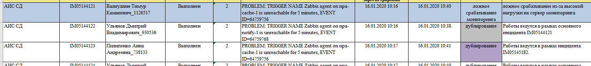

# Отчёт по дубликатам

Отчет необходимо выполнять каждый **четверг до 15:00**

Скачать шаблон куда вносить изменения [Шаблон](file:///E:/download/attachments/25231463/%D0%9E%D1%82%D1%87%D1%91%D1%82%20%D0%BF%D0%BE%20'%D0%B4%D1%83%D0%B1%D0%BB%D0%B8%D0%BA%D0%B0%D1%82%D0%B0%D0%BC'%20%D0%BA%D1%80%D0%B8%D1%82%D0%B8%D1%87%D0%BD%D1%8B%D1%85%20%D0%B8%D0%BD%D1%86%D0%B8%D0%B4%D0%B5%D0%BD%D1%82%D0%BE%D0%B2%20%D0%A8%D0%90%D0%91%D0%9B%D0%9E%D0%9D.xlsx?version=1&modificationDate=1579246489729&api=v2)

Перейти по адресу [Отчет по критичным инцидентам HPSM](https://bi.mos.ru/portal/report/%D0%A1%D0%98%D0%9B%D0%9E%D0%92%D0%98%D0%9A%D0%98%20%D0%98%20%D0%A2%D0%A0%D0%90%D0%9D%D0%A1%D0%9F%D0%9E%D0%A0%D0%A2/%D0%A1%D0%98%D0%A2_1%20%D0%9E%D0%B1%D1%89%D0%B0%D1%8F%20%D0%BE%D1%82%D1%87%D0%B5%D1%82%D0%BD%D0%BE%D1%81%D1%82%D1%8C/%D0%A1%D0%B8%D0%A2_1_01%20%D0%9E%D1%82%D1%87%D1%91%D1%82%20%D0%BF%D0%BE%20%D0%BA%D1%80%D0%B8%D1%82%D0%B8%D1%87%D0%BD%D1%8B%D0%BC%20%D0%B8%D0%BD%D1%86%D0%B8%D0%B4%D0%B5%D0%BD%D1%82%D0%B0%D0%BC)

Период выбираем **неделю** с четверга 15:00 по четверг 15:00, все проекты

Чтобы скачать файл надо нажать как показано на скриншоте 

Открываем скаченный отчет и переходим на вкладку "Детализация".

Здесь нужно:

* Удалить столбец J "дополнительные сведения".
* Проанализировать инциденты, надо найти дубли и инцидент к которому они привязаны, после чего сначала скопировать основной инцидент в шаблон, ниже добавить дубли к нему.

Заходим по адресу [Отчет по критичным инцидентам IT2G](http://172.17.21.67/Reports/Pages/Report.aspx?ItemPath=/%D0%9E%D1%82%D1%87%D0%B5%D1%82%D1%8B+%D0%BF%D0%BE+%D0%A1%D0%A2%D0%9F/%D0%9E%D1%82%D1%87%D0%B5%D1%82+%D0%BF%D0%BE+%D0%BA%D1%80%D0%B8%D1%82%D0%B8%D1%87%D0%BD%D1%8B%D0%BC+%D0%B8%D0%BD%D1%86%D0%B8%D0%B4%D0%B5%D0%BD%D1%82%D0%B0%D0%BC+%28IT2G%29)

Период выбираем **8 дней** **с четверга по пятницу**, все проекты, обязательно сверяемся по времени.

Где в исполнителях указаны сотрудники 0 линии - дубликаты, копируем id и заносим данные в шаблон по дубликатам, не забывая добавить основной инцидент.

После того как перенесли инциденты и дубли их нужно покрасить определенными цветами.

  - основной инцидент

 - дубль с другим описанием инцидента

 - дубль с аналогичным описанием инцидента \(номер EVENT ID может отличаться, это ID триггера в заббиксе\)

Пример покраски показан ниже.

После заполнения шаблона отчета по дублям, заполняем сверху дату, направляем данный отчет письмом в адрес Гороховой Юлии, Любивого Николая.

