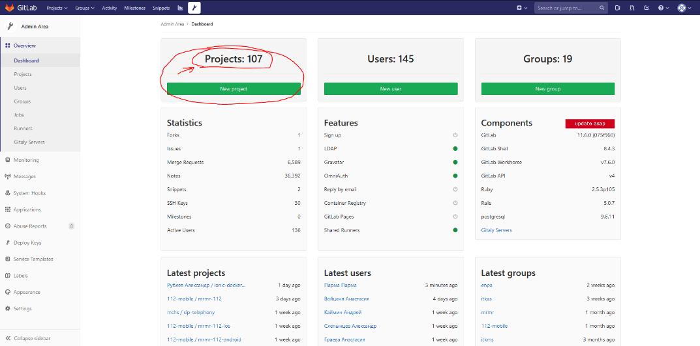

# Добавление пользователя в GitLab

Перейти по ссылке [http://git.it2g.ru/](http://git.it2g.ru/) и войти под УЗ с правами администратора \(доменная учетная запись\). Если необходимы права админа – запросить у SD 5/2 2/2.

Нажать на иконку - если этого значка нет, значит на учетную запись необходимо запросить права администратора.

Войти в перечень проектов – Projects:xxx

Выбрать нужный проект и нажать

Edit

Далее перейти в меню

Members

Найти пользователя по имени \(при этом пользователь должен авторизоваться в систему, либо необходимо добавить его вручную\):

Выбрать необходимые права доступа и добавить пользователя нажав кнопку

Add to project

