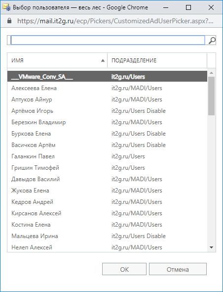
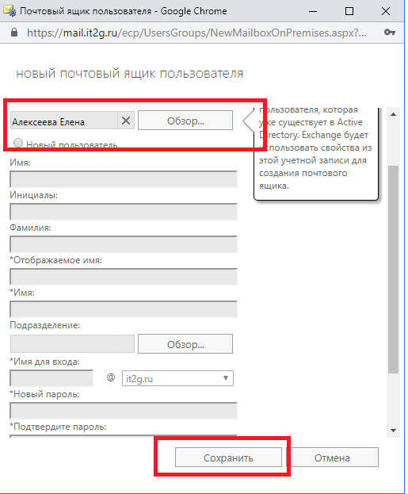

# Создание почтового ящика

После создания доменной учетной записи пользователя необходимо:

Перейти по ссылке:

[https://mail.it2g.ru/ecp/](https://mail.it2g.ru/ecp/)

Ввести логин и пароль

exchadmin

vEDvVfTFwJWwJ/ip2rof

Для создания пользователя выбрать вкладку «почтовые ящики», «+», «Почтовый ящик пользователя»

После выбора «Почтовый ящик пользователя», выбираем уже существующий \(пользователь должен быть создан в Active Directory\)

Через поиск находим созданную учетную запись

Жмем

Сохранить

Учетная запись пользователя Exchange создана.

Пароль от доменной УЗ.

**При добавлении почтового ящика для должности "РП", "RP", "Руководитель проекта \(-тов\)" - просьба выбирать базу данных почтовых ящиков - IT2G-VIP**

\*\*\* вкладка Общие - дополнительные параметры - База данных почтовых ящиков.

