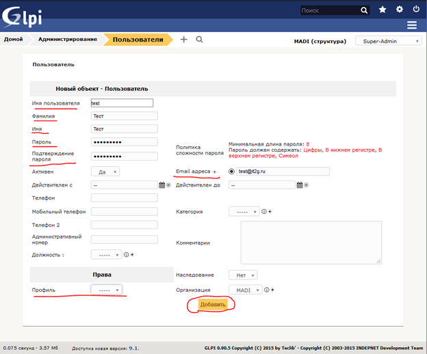

# Создание пользователя в GLPI IT2G MADI

## Создание пользователя в GLPI IT2G MADI

## **Создание пользователя в GLPI IT2G:**

В GLPI IT2G настроен LDAP

Для добавления нового пользователя необходимо перейти в структуру

Admin

Затем меню администрирования пользователей и перейти в

Связь с LDAP

Далее импортировать нового пользователя \(пользователь должен быть добавлен в AD\):

Пользователи, которые были добавлены ранее, в строке поиска отображаться не будут.

Заполнить критерии поиска пользователя и нажать

Поиск

Выбрать из списка ниже нужного пользователя и импортировать:

Перейти в карточку пользователя и изменить права, группы \(**пример для 0-й линии**\):

## **Создание пользователя и GLPI MADI:**

Для добавления пользователя в GLPI MADI необходимо перейти в меню администрирования пользователями и нажать

Добавить пользователя

Добавить нового пользователя. Заполнить поля:

Пароль – Qwerty123 \(затем, пользователь может изменить свой пароль на новый\)

Email – согласно учетным данным \*@[it2g.ru](http://it2g.ru/)

Добавить Права:

Изменить группы:

