# Создание пользователя в Oktell

Для создания учетных записей в Oktell необходимо залогиниться под аккаунтом

Логин: starostinie

Пароль: Qwerty123

В разделе «Администрирование» выбрать пункт

Пользователи

Далее в правом окне нажать на кнопку

Добавить или Ctrl+N

В открывшемся окне заполнить блок – «Информация о пользователе»

Полное имя: ФИО сотрудника полностью

Отдел: КЦ

Статус: Действующий признак

Выбрать пункт

Пользователь является оператором

Далее необходимо заполнить блок «Аутентификационная информация» \(Логин/Пароль\)

Пароль для пользователя можно как сгенерировать, так и ввести произвольный.

Далее заполняется блок «Права контроля»

В левой колонке отмечаются пользователи, которые могут контролировать создаваемого \(супервизоры, начальник КЦ\). Права контроля зависят от группы \(линии\) пользователя.

В правой колонке отмечаются пользователи, которых создаваемый может контролировать \(для роли «Оператор КЦ» в данном случае - никто\).

Далее необходимо выбрать вкладку

Доступ

В открывшемся окне, в блоке «Роли пользователя» необходимо выбрать 

Оператор callцентра

Необходимые пользователю права доступа будут назначены автоматически.

Далее необходимо перейти во вкладку

Номера

В открывшемся окне, справа необходимо выбрать

Создать

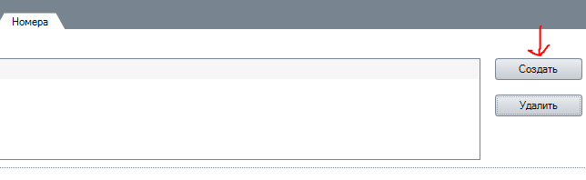

В блоке «Параметры номера» необходимо ввести 4х-значный \(1\*\*\*\) внутренний номер абонента \(номер должен быть свободен\)

Поле «Описание» заполняется автоматически.

«Режим вызова абонентов» - не изменять.

Далее необходимо выбрать весь временной интервал в блоке «Правило звонка», мышкой выделить всю строку справа от ФИО пользователя.

Далее нажать

Сохранить или нажать F2

В появившемся общем списке пользователей _**обязательно**_ нажать

Применить

Далее необходимо включить созданного оператора в группу 1000 \(Общая группа обзвона операторов\). Для этого, в блоке «Администрирование» необходимо выбрать раздел

Внутренние номера

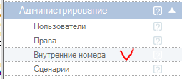

В открывшемся списке номеров выбрать 1000, двойным кликом открыть свойства группы.

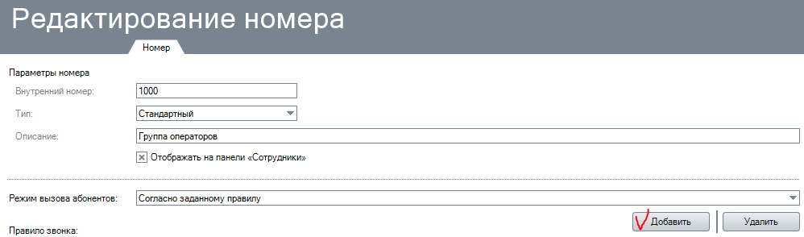

В открывшемся окне, ничего не изменяя, нажать

Добавить

В появившемся окне выбрать нужного сотрудника и двойным кликом добавить список группы:

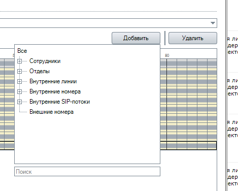

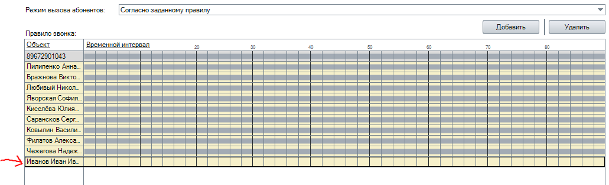

Далее заполнить Правило звонка – выделить мышкой весь временной интервал.

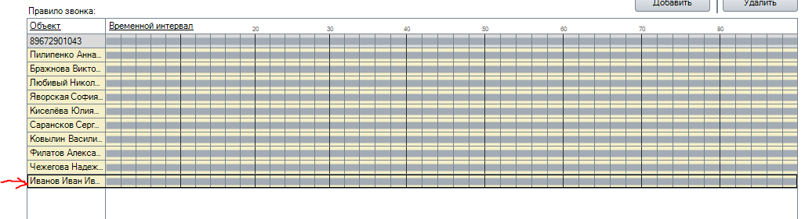

Далее нажать

Сохранить или F2 

В появившемся списке внутренних номеров обязательно нажать

Применить

Далее необходимо добавить нового оператора к задаче по обработке входящих вызовов.

Для этого необходимо войти в Call-центр: В блоке «Call-центр» выбрать

Войти в сall-центр

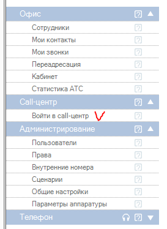

Выбрать раздел задачи

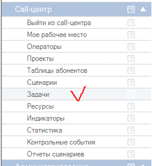

В правой половине окна «Задачи» выбрать

Входящие вызовы

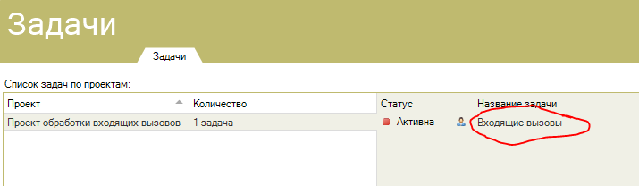

Перевести в пассивный режим кнопкой

Сменить статус или нажать Ctrl+S:

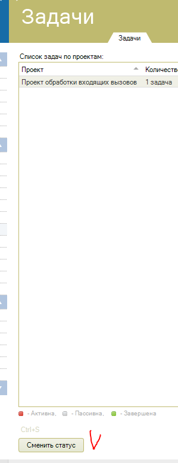

Далее двойным кликом открыть задачу «Входящие вызовы», в открывшемся окне выбрать вкладку

Ресурсы

В открывшейся вкладке, в первом столбце «Операторы» - выбрать нового оператора в списке.

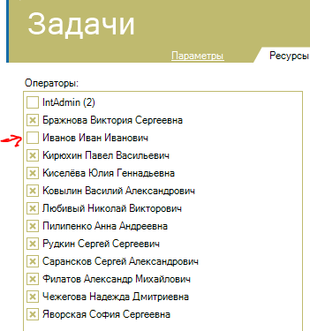

Нажать

Сохранить или F2

Сменить статус задачи на активный, выйти из call-центра.

Всё вышеописанное может выполняться только сотрудником с правами «Администратор».

