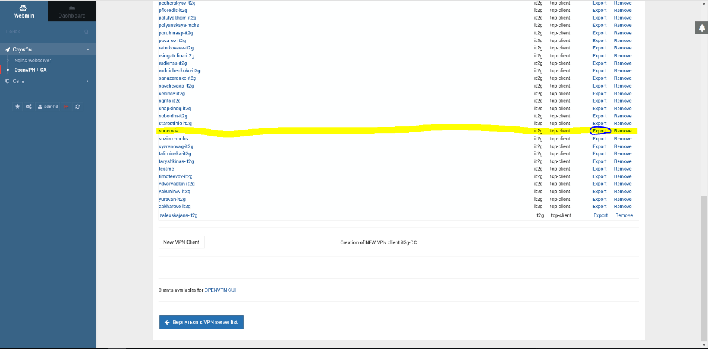

# Создание сертификата OpenVPN для офиса

Инструкция по выдаче подключения по OpenVPN

[https://172.17.21.1:10000](https://172.17.21.1:10000/)

adm-hd

d71c331df198

Выбираем «Службы» - OpenVPN + CA

Для выпуска нового сертификата

Certification Authority List

Выводим список ключей:

Опускаемся ниже и вводим имя согласно доменной учетной записи:

Создаем нового клиента VPN нажав

VPN List

Открываем

Client List

Опускаемся ниже и нажимаем

New VPN Client

1. Выбираем и выпадающего списка имя
2. Вводим IP address сервера
3. Fast LZO – NO
4. заполняем поле «ccd file content»
5. Жмем
6. Сохранить

IP server

185.118.64.212

ccd file content

push "route 172.17.20.0 255.255.255.0"

push "route 172.17.21.0 255.255.255.0"

push "dhcp-option DNS 172.17.21.3"

push "dhcp-option DNS 172.17.21.9"

Далее выбираем из списка выпущенный сертификат и нажимаем

Export

Удаляем из архива файл dh2048.per

Открываем файлы с расширением .conf и .ovpn через блокнот или Notepad++,  удаляем строчку «dh2048.percert»

После строки Remote вставляем 

tls-cipher "DEFAULT:@SECLEVEL=0"

Архив с ссылкой на ПО OpenVPN отправляем заявителю на доменную почту.

Ссылка для загрузки OpenVPN: [https://openvpn.net/index.php/open-source/downloads.html](https://openvpn.net/index.php/open-source/downloads.html)

