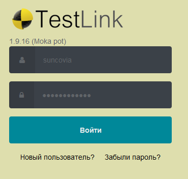

# Создание в TESTLINK

Для начала работы с Testlink необходимо авторизоваться: [http://testlink.it2g.ru/testlink/login.php](http://testlink.it2g.ru/testlink/login.php)

**Логин** - operator

**Пароль** - Qwerty123

## **Чтобы добавить нового сотрудника в систему Testlink необходимо:**

1.  Войти в систему под УЗ, имеющей права администратора

2. Перейти в меню «Администрирование»:

3. Внизу страницы добавить нового сотрудника кнопкой «Создать»:

4. Заполнить данные нового пользователя и сохранить:

5. Далее необходимо предоставить права на конкретный проект с нужным уровнем доступа

6. Перейти в меню «администрирование» &gt;&gt; «Доступ к продукту». Выбрать необходимый проект, пользователя и роль:

7. Нажать кнопку «Изменить»

